<p align="center">
  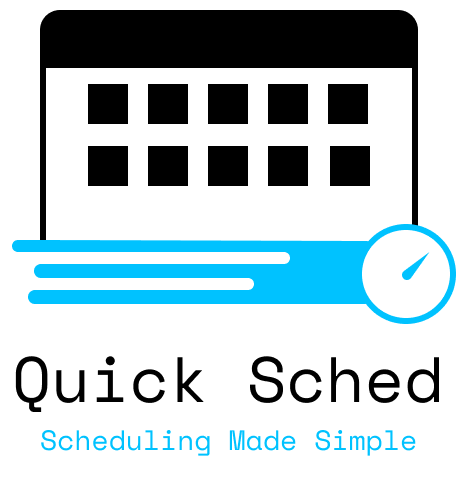
</p>


[](https://github.com/AndrewRoe34/quick-sched/actions)
[](https://github.com/AndrewRoe34/quick-sched/releases)


QuickSched is a robust, dynamic scheduling platform that provides unparalleled automation for generating timetabled daily/weekly schedules. This platform comes with its own scheduling, timetabling, serialization tooling, intelligent/flexible parser, integrated systems logging, and Google Calendar support.

## Setup

Head over to [here](https://github.com/AndrewRoe34/quick-sched/releases) and download the latest release. To run the application:
```
# Mac, Linux
sh run.sh

# Windows
run.bat
```
**Note: You need Java 17 (or newer) to run this application**

## Usage
> Newbie Tip: To see how `QuickSched` works without having to create the data yourself, you can have it generate dummy data for you. See [here](#generate-dummy-data) for more details.

QuickSched makes it trivially simple to create a fully customizable schedule. Here we go over how to work with some of these core mechanics.

### Features of QuickSched

This platform supports the following:
* Add/Mod/Delete/Get Tasks, Cards, & Events
* Customizable scheduling preferences (e.g. number of hours, time of day, etc.)
* Dynamic scheduling closely integrated with settings
* Intelligent timetabling that works around time-blocks and uses 'clean' start/end times
* Serialization tooling that handles pointer referencing and automatic task deprecation
* Intelligent parser that allows 'flexible' argument entry and time expressions
* Export schedule to Google Calendar
* Generate detailed reports with the 'report' command
* Bespoke log tooling


We'll be taking a closer look at what each command involves below.

### Tasks
Tasks are activities that have an estimated number of hours and are due on a particular day (note: Tasks can be broken up into SubTasks unlike Events).
```
Usage:
  task
  task <name> <hours> [cardId] @ <date>

Notes:
  - Use '@' to signal the start of a time expression. It must be on its own, followed by the date.

Required:
  - name    Name for the created Task (whitespace only is not permitted, quotes required).
  - hours   Number of hours for a given Task (decimal is allowed, but only 0.5).
  - date    Due date so the scheduling platform can assign it appropriate days.

Optional:
  - cardId  Id referencing a Card for its tag and color. Must prefix with '+C'.

Examples:
  task
  task "finish hw3" 3.5 @ eow
  task +C2 @ 01-11-2024 6.0 "prep for exam"
```
When no args are provided, a chart is displayed of all the previously created Tasks.

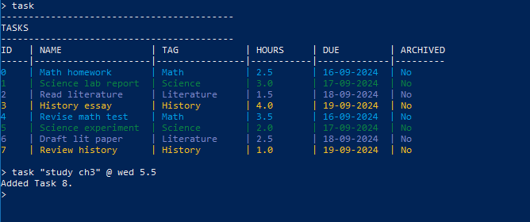

### Cards
Cards serve as labels and colors for Tasks and Events. This helps will logically grouping data together.
```
Usage:
  card
  card <name> <color>

Required:
  - name    Name for created Card (whitespace only is not permitted, quotes required).
  - color   Color for Card.

Examples:
  card
  card "Supply Chain" GREEN
  card blue "Business Law"
```
When no args are provided, a chart is displayed of all the previously created Cards.

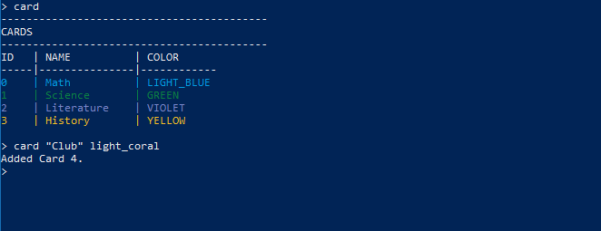

### Events
Events serve the role of time-blocks, both recurring and individual. Events are best compared to workouts, classes, and meetings. Events cannot be broken up.
```
Usage:
  event
  event true <name> [cardId] @ <date> <timestamp>
  event false <name> [cardId] @ [date] <timestamp>

Notes:
  - Use '@' to signal the start of a time expression. It must be on its own, followed by the date/timestamp.
  - Recurring Events allow multiple dates for 'days of the week'. However, individual Events allow only 1 date.

Required:
  - bool        Whether the event is recurring
  - name        Name for created Event (whitespace only is not permitted, quotes required).
  - timestamp   Timestamp for the Event that represents the start/end time for the day

Optional:
  - date        Days on which the Event is to be assigned
  - cardId      Id referencing a Card for its tag and color. Must prefix with '+C'.

Examples:
  event
  event false "study" @ 9-4
  event true @ mon wed fri 11-12:45 +C2 "Class2"
```
When no args are provided, a chart is displayed of all the previously created Events.

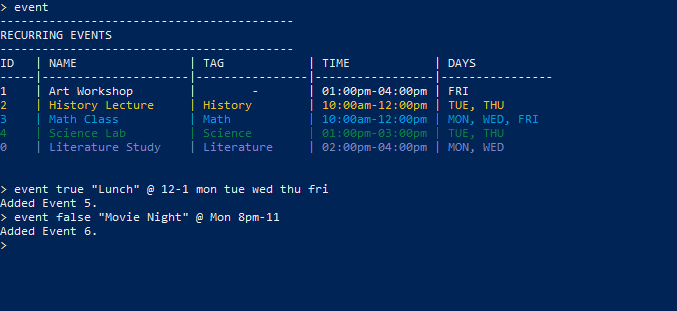

### Scheduling
QuickSched offers multiple ways to view your upcoming schedule.
```
Usage:
  sched
```
This command tells QuickSched to both schedule/timetable all your scheduling data as well as generate a table for you to view.

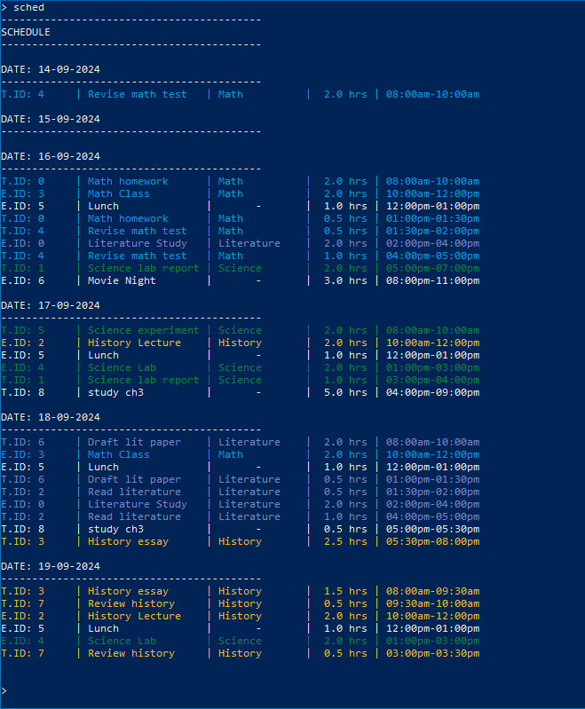

However, another useful command to quickly view your scheduled Tasks is this command here.
```
Usage:
  subtask
```
This displays all your scheduled/timetabled Tasks in an easy to follow chart.
This command tells QuickSched to both schedule/timetable all your scheduling data as well as generate a table for you to view.

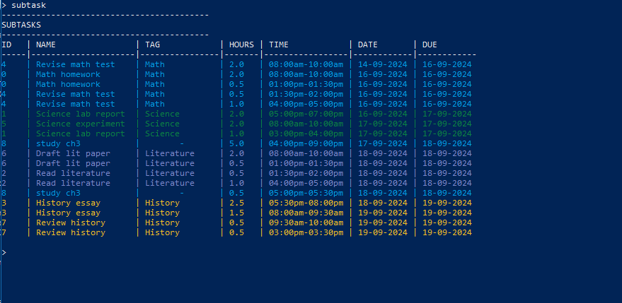

### Google Calendar
A great benefit of QuickSched is that you can quickly export your generated schedule over to Google Calendar for easy access across all devices.
```
Usage:
  google
```
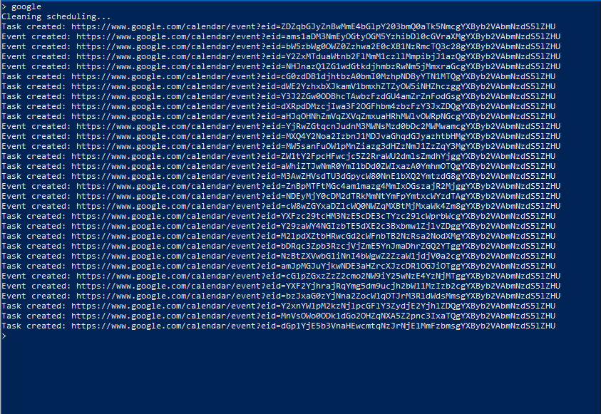

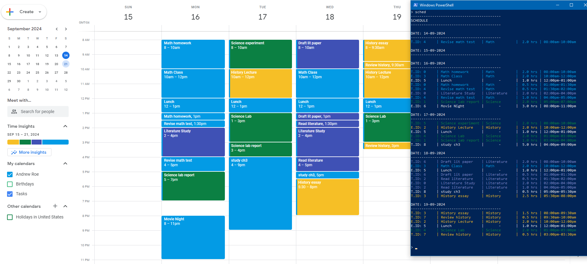

### Logging
One feature that greatly helps with bug reporting and seeing how the scheduler worked is our built-in EventLogger.
```
Usage:
  log

Example:
  log
```
This generates a timestamped log from the start of the session till the current moment.

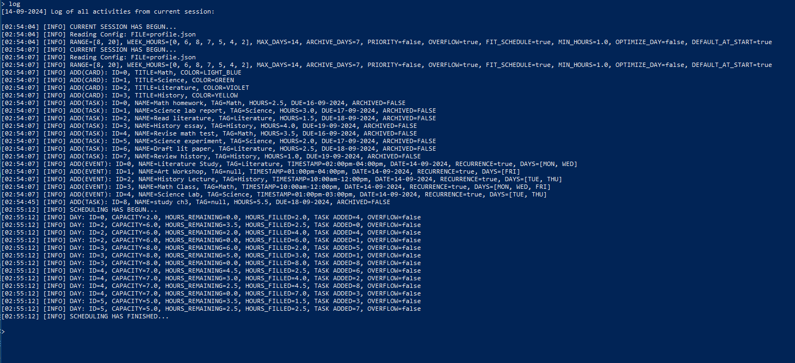

### Config
User configurations is what drives the customizability and dynamic nature of QuickSched. We've designed the Config Dialog to be both straightforward and brief.
```
Usage:
  config
```
Simply enter the id for whatever option you'd like to modify and then follow the provided format.

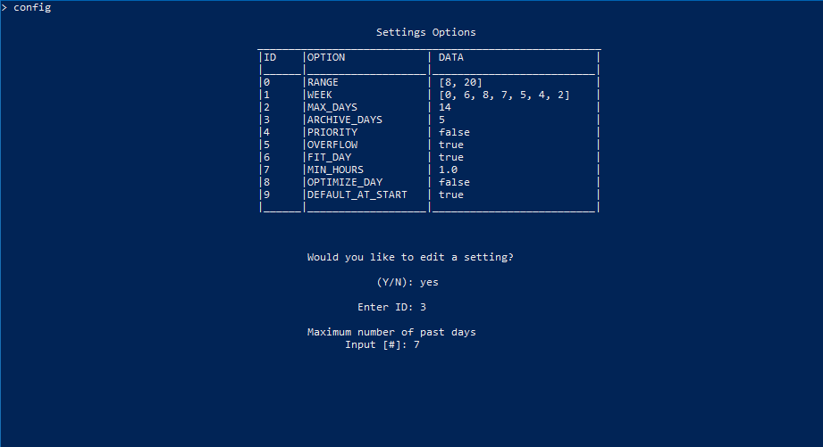

### Read & Save
QuickSched makes it very convenient to quickly load up scheduling data from your serialization file.
```
usage:
  read
  read <filename>

Required:
  - name   Name of the serialization file being read

Examples:
  read
  read fall
```
When no arguments are provided, it displays all the available serialization files. When a file is provided, it deserializes the file contents.

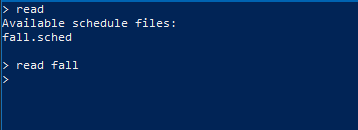

As for saving, QuickSched makes the process quick and simple.
```
Usage:
  save
  save <name>

Required:
  - name   Name of the serialization file being saved

Examples:
  save
  save my_data
```
When no arguments are provided, it saves to the last saved or read file location.

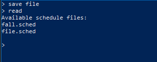

## Generate dummy data

To quickly generate a dummy schedule, simply `read` the provided serialization file and afterwards build your schedule via `sched`. Enter the following:
```
read fall
sched
```

This will populate your Tasks, Cards, Events, as well as generate your Schedule and SubTasks.

## Reference Manual
```
Quick Sched is a dynamic scheduling platform that automates the process of creating a comprehensive schedule.

Command Categories:

Task Management:
  - task      Create a new Task or display all Task data
  - card      Create a new Card or display all Card data
  - event     Create a new Event or display all Event data
  - mod       Modify a scheduling item
  - delete    Delete a scheduling item
  - get       Retrieves Task, Events, or Cards to be displayed

Scheduling Operations:
  - build     Builds a fresh schedule
  - sched     Display user schedule
  - subtask   Displays all scheduled SubTasks
  - report    Produce a report of all schedule data

File Management:
  - read      Display all serialization files or read in a file
  - save      Update the stored db with new scheduling data
  - google    Export schedule data to Google Calendar
  - doc       Display documentation for a command
  - ls        Display all available commands

System and Configuration:
  - config    View or modify user config settings
  - log       Display the system log to console
  - quit      Exit application

References:
  - date      List of all valid date formats
  - ts        List of all valid timestamp formats
  - color     List of all valid colors

Use 'doc <topic>' to view detailed information.
```

## Contributing

We welcome contributions from everyone who is interested in improving QuickSched and expanding its capabilities. Whether you're fixing bugs, adding new features, or improving documentation, your help is appreciated!

Before you start contributing, please make sure to read our [CONTRIBUTING.md](CONTRIBUTING.md) file. It contains all the information you need to get started, including how to submit pull requests, our coding standards, and the process for reporting bugs.

If you have any questions or want to discuss your ideas before diving in, be sure to join our Slack group:

[](https://join.slack.com/t/quicksched/shared_invite/zt-2k0bmf49j-V6avYCrNJFFWVTpdER69tg)
