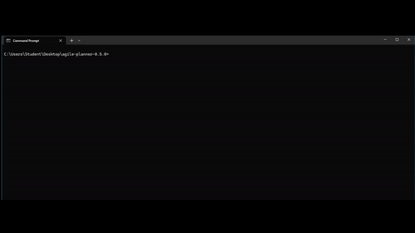
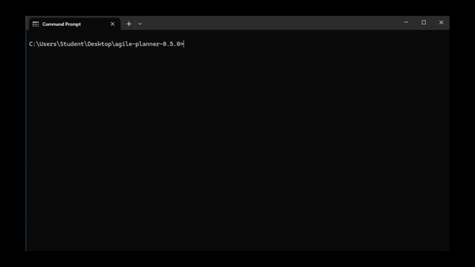
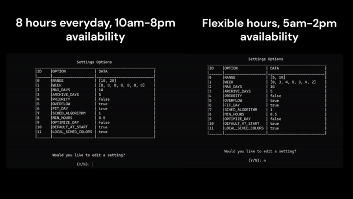
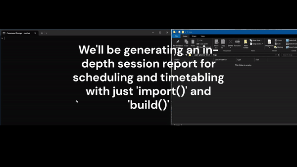

<p align="center">
  
</p>


[](https://github.com/AndrewRoe34/agile-planner/actions)
<!-- [](https://github.com/AndrewRoe34/agile-planner/releases) -->

Agile Planner is a robust, dynamic scheduling platform that provides unparalleled automation for students seeking to generate both daily and weekly planners. Agile Planner offers plenty of proprietary software such as logging, scheduling algorithms, serialization, and a flexible parser for user commands. The goal is to continue expanding upon the current CLI iteration and eventually offer a web-based component.



These instructions will guide you through the setup process to get the project running on your local machine for development and testing purposes.

### Prerequisites

Before you begin, ensure you have the following installed:
- **Java Development Kit (JDK)**: Version 11 (required to compile Java code).

Optional:
- **IntelliJ IDEA**: This project is developed using IntelliJ IDEA, which provides excellent support for Gradle projects. You can download it from the JetBrains website. The Community Edition is free, and the Ultimate Edition is available for a free trial.

### Installation
1. **Clone the repository**:
```bash
git clone https://github.com/AndrewRoe34/agile-planner.git
```
2. **Navigate to the project directory**:
```bash
cd agile-planner
```
3. **Build the project using the Gradle Wrapper**:
```bash
# Unix/Linux
./gradlew build

# Windows Command Prompt
gradlew.bat build
```
4. **Run the application**:
```bash
# Unix/Linux
./gradlew run --console=plain

# Windows Command Prompt
gradlew.bat run --console=plain
```
### Configure IntelliJ IDEA
After building the project, you can open it in IntelliJ IDEA:
1. Open IntelliJ IDEA and select Open or Import.
2. Navigate to your project directory and select the build.gradle file.
3. Choose ‘Open as Project’.
4. IntelliJ IDEA will import the project and set everything up based on the Gradle configuration.

Now, let's learn what Agile Planner has to offer!

## Using Agile Planner
Agile Planner makes it trivially simple to create a fully customizable schedule. Here we go over how to work with some of these core mechanics.

### Booting up Agile Planner


When you first start up Agile Planner, you're greeted with a startup log of your current config settings, OS information, warnings or issues, etc. Afterwards, you work with platform just like a console. Load up a script and get started!

### Personalized Scheduling


Agile Planner's scheduling and timetabling mechanics were carefully designed to be dynamically alterable with the extensive config options. Don't want to work on Mondays? Don't sweat it, Agile Planner will work out a new schedule so you can sleep in. Not a morning person? Well, you can switch up your general availability to afternoons and evenings only.

With this powerful range of options, YOU control your scheduling!

### Session Logs


If there's one thing we can all agree on, it's this: No one likes to constantly reboot a system to get the same data over and over. Sure, you have Google Calendar, but what if the wifi is out? Introducing Session Logging, Agile Planner's latest feature! This mechanic allows you to fully generate an entire report on all your scheduling, timetabling, task, subtask, card, and event related data (what a mouthful). Data is cleanly formatted via tables so you can jump around, and the schedule is perfectly structured so you can cross each item off the list.


## Configuration
Agile Planner can be customized through a `settings.cfg` file. Below are the available settings and their descriptions:

- **range**: An array defining the start and end hours of your daily schedule (in 24-hour format). For example, `[9, 20]` sets the schedule from 9 AM to 8 PM.
- **week**: An array representing the number of hours allocated for each day of the week. For example, `[8, 8, 8, 8, 8, 8, 8]` allocates 8 hours per day.
- **maxDays**: The maximum number of days for which a schedule can be generated. For example, `14` allows for a two-week schedule.
- **archiveDays**: The number of days past tasks are stored before being archived. For example, `5` stores tasks for five days.
- **priority**: A boolean value indicating whether task priority is considered in scheduling (currently not implemented).
- **overflow**: A boolean value that, when set to `true`, reports the overflow status of tasks.
- **fitDay**: A boolean value that determines whether tasks are capped at the end of the day.
- **minHours**: The minimum number of hours a task can be assigned in a day. For example, `0.5` allows for half-hour tasks.
- **optimizeDay**: A boolean value that, when `true`, reorganizes tasks to maximize their positioning throughout the day.
- **defaultAtStart**: A boolean value that determines whether scheduling begins at the start of the day.

Here's an example `settings.cfg` file with default values:
```json
{
  "range": [
    9,
    20
  ],
  "week": [
    8,
    8,
    8,
    8,
    8,
    8,
    8
  ],
  "maxDays": 14,
  "archiveDays": 5,
  "priority": false,
  "overflow": true,
  "fitDay": true,
  "minHours": 0.5,
  "optimizeDay": false,
  "defaultAtStart": true,
  "formatPrettyTime": true
}
```

## Contributing

We welcome contributions from everyone who is interested in improving Agile Planner and expanding its capabilities. Whether you're fixing bugs, adding new features, or improving documentation, your help is appreciated!

Before you start contributing, please make sure to read our [CONTRIBUTING.md](CONTRIBUTING.md) file. It contains all the information you need to get started, including how to submit pull requests, our coding standards, and the process for reporting bugs.

If you have any questions or want to discuss your ideas before diving in, be sure to join our Slack group:

[](https://join.slack.com/t/agileplannergroup/shared_invite/zt-2k0bmf49j-V6avYCrNJFFWVTpdER69tg)
